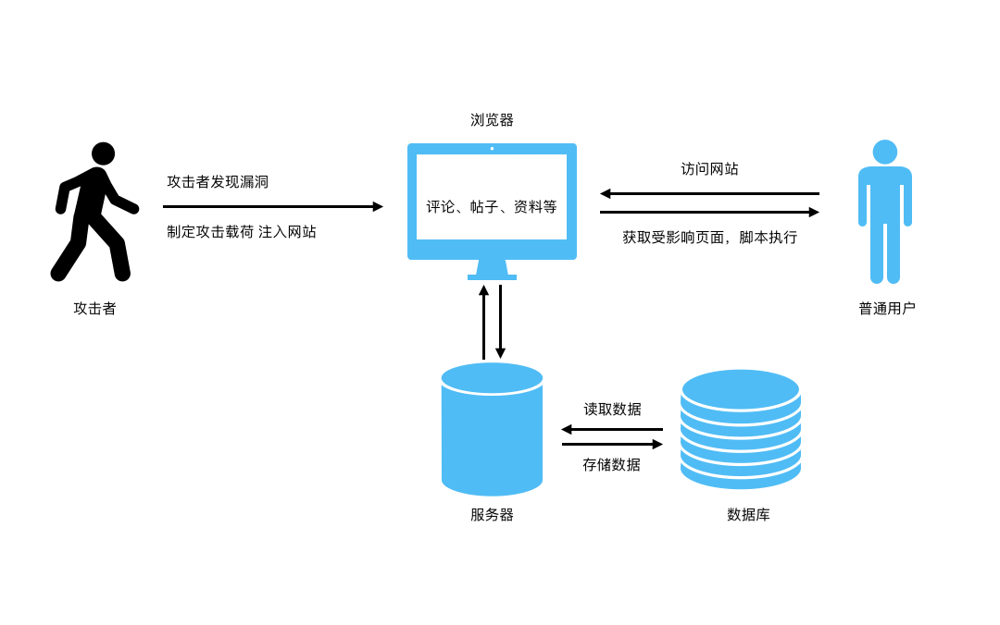
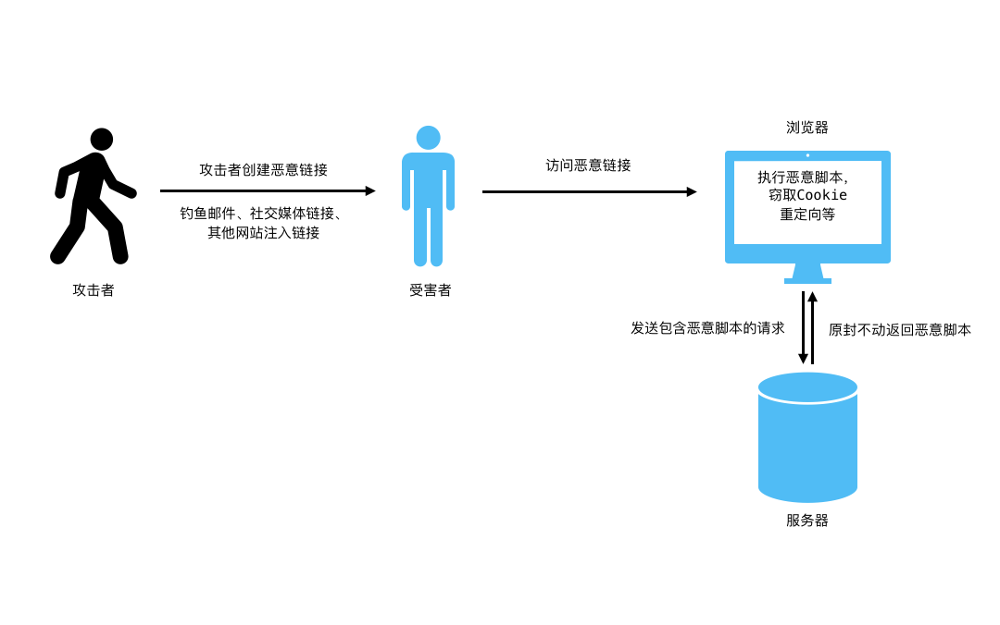
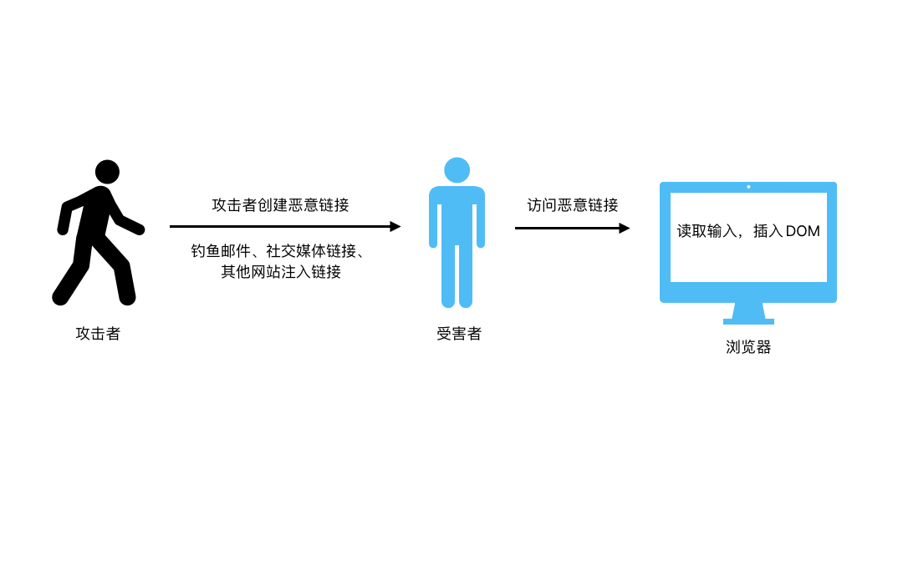
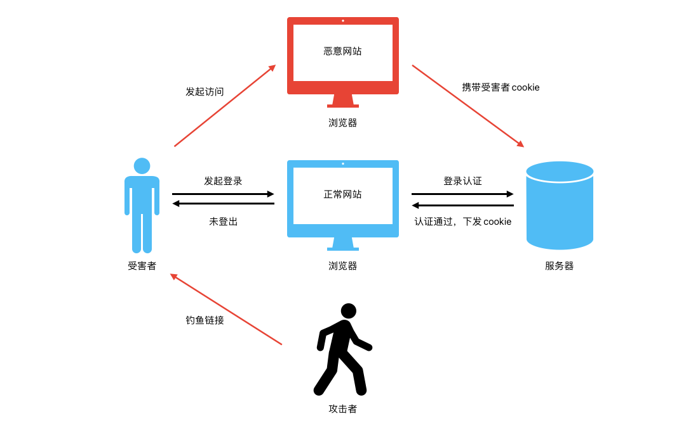
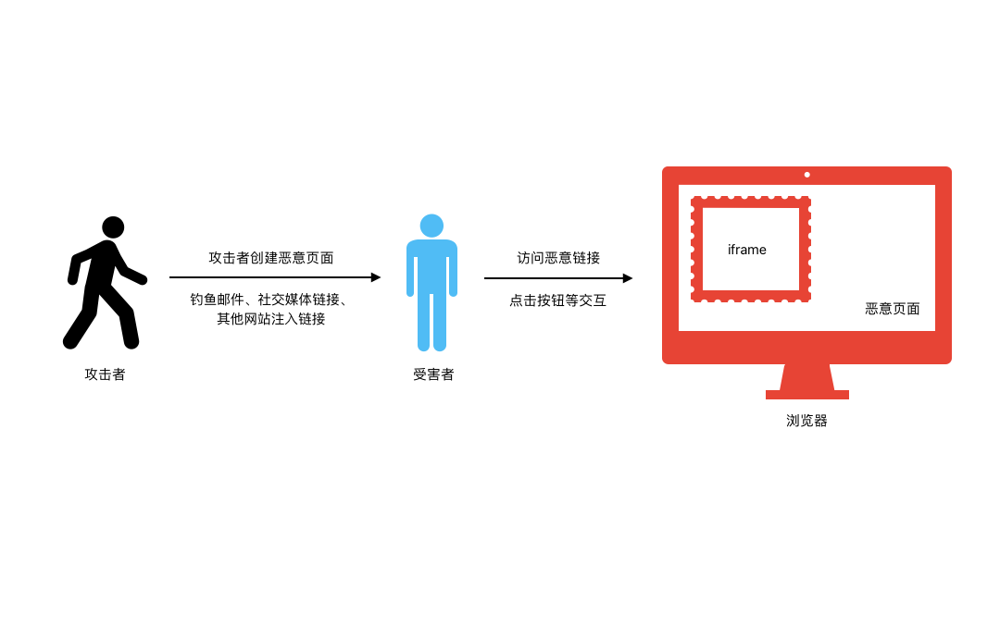

# 前端安全演示分享

## 跨站脚本攻击（XSS）

跨站脚本攻击（XSS）是一种常见的网络安全漏洞，允许攻击者将恶意脚本注入到正常用户会看到的页面中。这些脚本在用户的浏览器中执行时，可以访问用户的会话token、cookie等敏感信息，甚至可以重写网页内容或重定向用户到其他网站。XSS攻击通常分为三种类型：存储型（Persistent）、反射型（Reflected）和基于DOM（Document Object Model）的XSS。

### [存储型XSS](./html/xss/stored.html) 

存储型XSS攻击发生在攻击者的输入被存储在目标服务器上，如数据库、消息论坛、访客留言板等。当用户浏览含有恶意脚本的页面时，脚本会被执行。

#### 示例

**后端代码（Node.js）：**

存储用户输入到数据库中，没有对用户输入进行充分的过滤或转义。

```javascript
// 用于存储留言的数组
const messages = []

// 获取所有留言
router.get('/xss/api/messages', (req, res) => {
	res.json(messages)
})

// 提交新留言
router.post('/xss/api/messages', (req, res) => {
	const message = req.body.message
	if (message) {
		messages.push(message) // 将新留言添加到数组中
		res.status(201).send({ message: 'successfully.' })
	} else {
		res.status(400).send({ error: 'Message is required.' })
	}
})
```

**前端代码：**

显示来自用户的评论，没有进行适当的转义。

```html
<h2>留言板</h2>
<form id="messageForm">
  <input type="text" id="messageInput" placeholder="留言内容" required>
  <button type="submit">提交留言</button>
</form>
<ul id="messagesList"></ul>

<script src="./stored.js"></script>
```

```javascript
document.getElementById('messageForm').addEventListener('submit', function (e) {
	e.preventDefault()
	const messageContent = document.getElementById('messageInput').value
	fetch('/xss/api/messages', {
		method: 'POST',
		headers: {
			'Content-Type': 'application/json',
		},
		body: JSON.stringify({ message: messageContent }),
	})
		.then(response => response.json())
		.then(data => {
			fetchMessages() // 重新加载留言
		})
		.catch(error => console.error('Error:', error))
})

function fetchMessages() {
	fetch('/xss/api/messages')
		.then(response => response.json())
		.then(messages => {
			const messagesList = document.getElementById('messagesList')
			messagesList.innerHTML = '' // 清空列表
			messages.forEach(message => {
				const li = document.createElement('li')
				li.innerHTML = message // 这里存在XSS漏洞
				messagesList.appendChild(li)
			})
		})
		.catch(error => console.error('Error:', error))
}

fetchMessages() // 页面加载时获取留言
```

**攻击示例：**

```


<a href="javascript:alert('XSS');">Click me!</a>
<iframe src="javascript:alert('XSS');"></iframe>
<button type="button" onclick="javascript:alert('XSS');">Click Me!</button>
<script>alert('XSS');</script>
```

**攻击路径：**



#### 真实案例
2014年针对社交媒体网站Twitter的“TweetDeck”应用程序的XSS攻击是一个著名案例。攻击者发布了一条包含恶意JavaScript代码的Tweet。当这条Tweet通过TweetDeck被查看时，嵌入的脚本在用户浏览器上执行，导致脚本自我复制并影响了大量用户。

### [反射型XSS](/html/xss/reflected?userInput=<script>alert('XSS')</script>)

反射型XSS（Reflected Cross-Site Scripting）攻击是一种常见的网络安全漏洞，属于跨站脚本攻击（XSS）的一种。这种攻击方式涉及到将恶意脚本注入到用户的请求中，然后由服务器动态生成响应页面时反射（即“回显”）这些脚本，最终在用户浏览器上执行。与存储型XSS不同，反射型XSS攻击不会将恶意脚本存储在目标网站上，而是利用用户点击恶意链接、访问带有恶意参数的URL或提交恶意表单数据时发生。

#### 示例

**后端代码（Node.js）：**

```javascript
router.get('/xss/api/reflected', (req, res) => {
	// 直接将输入查询反射给页面，没有进行适当的转义
	const userInput = req.query.input
	res.json({ message: userInput })
})
```

**攻击示例：**

```
/html/xss/reflected?userInput=<script>alert('XSS')</script>
/html/xss/reflected?userInput=
/html/xss/reflected?userInput=<a href="javascript:alert('XSS via Link')">Click me</a>
/html/xss/reflected?userInput=<div onmouseover="alert('XSS via Hover')">Hover over me</div>
/html/xss/reflected?userInput=<form action="javascript:alert('XSS via Form Submission')"><input type="submit" value="Submit"/></form>
```

**攻击路径：**



#### 真实案例

雅虎邮箱在过去遭遇了几起反射型XSS攻击，这些攻击揭示了安全漏洞的严重性以及对用户造成的潜在风险。在2019年，一位研究者发现了雅虎邮箱中的一个关键XSS漏洞，该漏洞允许攻击者窃取目标用户的电子邮件并将恶意代码附加到其发出的消息中。研究者通过发送含有隐藏JavaScript代码的电子邮件来利用这个漏洞，这些代码在受害者阅读邮件时执行。此外，攻击者还可以利用这个漏洞来静默转发受害者的邮件到外部网站、更改受损雅虎账户的设置，甚至创建电子邮件病毒，附加到所有发出的邮件的签名中「[”](https://www.securityweek.com/researcher-earns-10000-another-xss-flaw-yahoo-mail/)」。

### [基于DOM的XSS](./html/xss/dom.html)

基于DOM的XSS攻击（DOM-based XSS）是一种特殊类型的跨站脚本攻击，它发生在客户端浏览器中，而不涉及到服务器端的数据处理。这种攻击主要利用了网页的DOM（文档对象模型）环境中存在的漏洞，通过修改DOM环境中的数据来插入恶意脚本。与其他类型的XSS攻击相比，基于DOM的XSS攻击完全在客户端执行，不需要服务器处理恶意脚本。DOM型XSS攻击最常见的来源是 URL，通常使用 window.location 对象访问。攻击者可以构建一个链接，将受害者发送到易受攻击的页面，并在查询字符串和 URL 的片段部分中包含有效负载。这段代码利用JavaScript访问和修改DOM，从而执行未经授权的操作。这可能包括窃取cookie、会话劫持、重定向到恶意网站等。

#### 示例

**前端代码：**

```html
<h1>基于DOM的XSS攻击</h1>
<div id="message"></div>
<script src="./dom.js"></script>
```

```javascript
// 不安全的代码示例
document.getElementById('message').innerHTML = decodeURIComponent(location.search.split('msg=')[1]);
```

**攻击示例：**

```
http://example.com/?msg=
```

在这个例子中，网页通过JavaScript读取URL中的msg参数，并将其值直接插入到页面的DOM中。如果一个攻击者构造了一个含有恶意JavaScript代码的URL，当这个URL被访问时，恶意代码就会被执行。

**攻击路径：**



#### 真实案例
在2015年末至2016年初，eBay遭遇了一次严重的XSS漏洞。这个漏洞存在于eBay的一个重定向功能中，具体涉及到处理“url”参数的方式。这个参数被用于将用户重定向到平台上的不同页面，但问题在于，这个参数的值没有经过适当的验证。这使得攻击者能够注入恶意代码到页面中。攻击者通过这个漏洞能够实现对eBay卖家账户的完全访问权限，这包括操纵商品列表，以较低的价格销售商品，并窃取支付细节。这个漏洞不仅被用来操纵高价值商品的列表，比如汽车，而且还允许攻击者在未经用户同意的情况下进行交易。eBay最终修复了这个漏洞，但在此之前，攻击者已经利用这个漏洞进行了多次攻击。这个事件突显了即使是大型电商平台也可能面临网络安全威胁，且对于用户输入的验证和清理是防止XSS攻击的关键措施。

### 防御措施

- 对所有用户输入进行验证、过滤和转义。
- 使用内容安全策略（CSP）来减少XSS攻击的风险。
- 对于敏感操作，不要仅仅依赖于来自用户的输入。
- 在服务器端实现适当的输入处理逻辑，确保不信任的数据被安全处理。
- 使用现代Web框架和库，比如vue，react它们通常提供了自动的XSS防护。

## 跨站请求伪造（CSRF）

CSRF（Cross-Site Request Forgery，跨站请求伪造）攻击是一种常见的网络攻击方式。它允许恶意网站在用户不知情的情况下，以用户的名义向另一个网站发送请求。这种攻击利用了网站对用户的信任，尤其是当用户已经登录目标网站时，攻击者可以进行一些未经授权的操作，如更改密码、转账等。

### 示例

**后端代码：**

```javascript
// 设置一个简单的登录页面
router.get('/csrf/login', (req, res) => {
	res.send(`<form action="/csrf/login" method="post">
              <input type="text" name="username" placeholder="账号" />
              <input type="password" name="password" placeholder="密码" />
              <button type="submit">登录</button>
            </form>`)
})

// 登录接口，简化处理，实际开发需要安全验证
router.post('/csrf/login', (req, res) => {
	// 设置简单的登录Cookie
	res.cookie('auth', 'dummy-token')
	res.send('登录成功')
})

// 受保护的操作
router.post('/csrf/action', (req, res) => {
	const token = req.cookies.auth
	if (token === 'dummy-token') {
		res.send('执行成功')
	} else {
		res.send('没有通过验证')
	}
})
```

**前端代码：**

攻击者创建一个网页，这个网页包含一个自动提交的表单，目标是受害者网站的转账API。

```html
<body>
  <h1>你中奖了!点击按钮领取!</h1>
  <form action="/csrf/action" method="POST" id="fakeForm">
    <button type="submit">领取奖品！</button>
  </form>
  <script src="./csrf.js"></script>
</body>
```

```javascript
// 自动提交表单
document.getElementById('fakeForm').submit();
```

**攻击示例：**

```
http://wanner.vip/csrf/login // 先登录
http://wanner.vip:8000/html/csrf.html // 访问
```

**攻击路径：**



### 攻击原理

1. **受害者登录自己的账户**：并在其他标签页中仍然保持登录状态。
2. **受害者访问攻击者网站**：不知情的点击一个邮箱链接或被诱导访问了攻击者的网页。
3. **攻击者网页自动提交请求**：利用受害者的登录态，向受害者网站的API发送请求。

#### 同源策略（SOP）

同源策略是Web安全的基石之一，它阻止了一个源的文档或脚本与另一个源的资源进行交互。这是为了防止恶意文档窃取来自另一个源的数据。在这个上下文中，“源”由协议、域名和端口三部分构成。只有当这三者都匹配时，两个URL才算是"同源"的。

#### 跨站请求的工作方式

CSRF攻击并不直接违反同源策略。相反，攻击利用的是Web应用在用户浏览器中的行为，这些行为在用户未知情的情况下可以跨域发送请求。例如，如果用户已经登录了银行网站，他们的浏览器将保存登录凭证（如cookies）。如果在不登出银行网站的情况下，用户点击了一个恶意链接，这个链接可能会导致浏览器向银行网站发送一个请求，如转账操作。由于请求带有用户的凭证，银行网站可能会执行这个请求。

#### 为什么跨域问题不阻止CSRF攻击

- **浏览器自动携带凭证**：当浏览器向一个网站发送请求时，它会自动附带该网站的cookies（如果有的话）。这意味着，如果用户已经登录了某个网站，即使是从另一个网站发起的请求，只要请求指向那个已登录的网站，浏览器也会携带用户的身份凭证（cookies）。
- **限制在于响应**：同源策略主要限制从网站A向网站B发送请求后，网站A读取网站B的响应。在CSRF攻击中，攻击者通常不关心响应内容，他们只是想利用用户的浏览器向网站B发起请求。

### 真实案例

有几个著名的CSRF攻击真实案例：

1. TikTok（2020年）：TikTok存在一个漏洞，允许攻击者向用户发送含有恶意软件的消息。一旦恶意软件部署，攻击者可以利用它执行CSRF或跨站脚本（XSS）攻击，导致其他用户账户代表攻击者向TikTok应用提交请求。TikTok在三周内修补了这个漏洞​​。

2. McAfee（2014年）：Check Point研究人员发现McAfee网络安全管理器的用户管理模块存在CSRF漏洞，该漏洞允许恶意用户修改其他用户账户。该漏洞在版本8.1.7.3中得到修补​​。

3. YouTube（2008年）：普林斯顿大学的研究人员在YouTube上发现了一个CSRF漏洞，允许攻击者代表任何用户执行几乎所有操作，包括添加视频到收藏夹、修改朋友/家人列表、向用户联系人发送消息和标记不当内容。这个漏洞被立即修复​​。

### 防御措施

防御CSRF攻击的策略通常包括：
- **使用CSRF Token**：向用户的会话中添加一个唯一的、不可预测的值（CSRF Token），并要求所有的状态改变请求（如POST请求）都必须携带这个值。由于攻击者无法知道这个Token，他们无法构造一个有效的请求。
- **验证Referer头**：服务器可以检查HTTP请求的Referer头，以确保请求是从受信任的来源发出的。
- **利用SameSite Cookie属性**：这个属性可以限制第三方网站使用用户的cookie，根据属性值（Strict、Lax、None），可以阻止一些或所有跨站请求携带cookie。

## 点击劫持

点击劫持（Clickjacking）是一种视觉上的欺骗手段，攻击者通过在一个透明的iframe上覆盖一个看似无害的元素，诱使用户点击该元素，从而在不知情的情况下执行了攻击者想要用户执行的操作。这种攻击方式可以用于盗取用户信息、控制用户的网络会话，或者在用户不知情的情况下操控用户的账号。

### 示例

以下是一个简单的点击劫持案例。

**服务器设置：**

首先，我们设置一个简单的Node.js服务器：

```javascript
// 引入express
const express = require('express');
const app = express();
const path = require('path');

// 静态文件服务
app.use(express.static('public'));

// 主页路由
app.get('/', (req, res) => {
  res.sendFile(path.join(__dirname, 'index.html'));
});

// 监听3000端口
app.listen(3000, () => {
  console.log('Server running on port 3000');
});
```

在`public`目录下，我们可以创建一个`index.html`文件和一个攻击者的页面`attack.html`。

**真实页面（[index.html](./html/clickjacking/index.html)）**

```html
<!DOCTYPE html>
<html lang="zh">

<head>
  <meta charset="UTF-8">
  <title>安全页面</title>
  <style>
    body {
      margin: 0;
    }
  </style>
</head>

<body>
  <button id="safeButton">安全按钮</button>
  <script>
    document.getElementById('safeButton').onclick = function () {
      alert('您点击了安全按钮！');
    };
  </script>
</body>

</html>
```

**攻击页面（[attack.html](./html/clickjacking/attack.html)）**

```html
<!DOCTYPE html>
<html lang="zh">

<head>
  <meta charset="UTF-8">
  <title>攻击页面</title>
  <style>
    .box {
      position: relative;
    }
    iframe {
      position: absolute;
      top: 0;
      left: 0;
      opacity: 0.0001;
    }
  </style>
</head>

<body>
  <h1>点击下面的“奖励”按钮领取奖励</h1>
  <div class="box">
    <button>奖励</button>
    <iframe src="index.html" width="200" height="200"></iframe>
  </div>
</body>

</html>
```

**攻击路径：**



#### 攻击原理
上面提供的点击劫持攻击案例主要涉及两个页面：一个是正常的页面（`index.html`），另一个是攻击者创建的页面（`attack.html`）。攻击的过程如下：

1. **正常页面（`index.html`）**：这是一个含有一个按钮的简单页面。这个按钮的作用是显示一个警告框，告诉用户他们点击了按钮。这个页面本身是安全的，没有进行任何恶意操作。
2. **攻击页面（`attack.html`）**：攻击者创建了这个页面，并在页面中放置了一个`<iframe>`标签，这个`iframe`加载了正常页面（即`index.html`）。然后，攻击者通过CSS将`iframe`设置为透明，并且调整位置，使其覆盖在攻击页面上的某个元素上——在这个案例中，是一个诱导用户点击的文本（例如，“点击下面的‘奖励’按钮领取奖励”）。
3. **攻击执行**：当用户试图点击攻击页面上看似无害的元素（“奖励”按钮）时，实际上他们点击的是透明`iframe`中的按钮。因为`iframe`加载的是正常页面，所以用户实际上点击的是正常页面上的按钮，这就可能触发在正常页面上定义的任何操作。在这个简单的例子中，用户会看到一个警告框，但在更恶意的场景中，这种点击可能触发敏感操作，如发送表单数据或执行脚本，而用户则完全不知情。

攻击的关键在于用户被欺骗，以为他们在与攻击者的页面交互，但实际上他们的操作影响到了被嵌入的`iframe`页面。通过精心设计页面和元素的布局，攻击者可以在用户不知情的情况下诱导用户执行各种操作。这种攻击的危险之处在于它利用了用户的信任和对页面可视元素的理解，从而绕过了传统的安全防护措施。

### 真实案例
在2011年，意大利发生了一起著名的点击劫持案例，攻击者利用点击劫持技术劫持Facebook用户的“赞”操作。还有一个案例是2015年，一位加拿大广播公司的记者发现自己不知不觉中为加拿大保守党点了赞。在这种攻击中，攻击者创建一个不可见的iframe或者通过其他方法遮盖真实的“点赞”按钮，并将其与用户看到的另一个元素重叠。当用户认为他们在点击一个无害的按钮或链接时，实际上他们点击的是隐藏的“点赞”按钮，从而在不知情的情况下为某个页面或帖子点赞。危害在于，它可以用来人为地提高某个页面或内容的受欢迎程度，误导其他用户和影响他们的观点。此外，这种攻击还可能用于传播恶意软件，当用户点击被劫持的“点赞”按钮时，他们可能会被重定向到含有恶意软件的网站。

### 防护措施

防护点击劫持攻击的措施分为客户端和服务器端两种：

#### 客户端防护措施：

1. **使用支持Intersection Observer API的浏览器**：这个API可以追踪网页上目标元素的“可见性”，帮助检测被隐藏的iframe。

2. **安装防护插件**：
   - **NoScript**：这个浏览器插件阻止用户点击不可见或伪装的网页元素。但它仅支持Mozilla Firefox。
   - **NoClickjack**：这个插件强制网页上的所有iframe都可见，支持Google Chrome、Mozilla Firefox、Opera和Microsoft Edge。

#### 服务器端防护措施：

1. **设置X-Frame-Options HTTP头**：这个HTTP头部指令可以阻止网页被其他页面通过iframe嵌入，提供了三个选项：DENY（不允许任何域嵌入）、SAMEORIGIN（仅允许同源域嵌入）和ALLOW-FROM（允许特定来源域嵌入）。

2. **使用Content Security Policy (CSP)的frame-ancestors指令**：这个指令可以限制哪些网页可以嵌入当前页面，有效防止恶意嵌入。

通过这些措施，网站管理员和用户可以显著提高对点击劫持攻击的防御能力。

## 第三方库的安全

### 安全风险

在当前的网络环境中，第三方库的使用非常普遍。使用第三方库可以大大提高开发效率，但同时也可能带来一些安全风险。

1. **依赖风险**：当你引入一个第三方库时，你不仅仅引入了这个库本身，还引入了它的所有依赖。这些依赖可能存在已知的安全漏洞，或者在未来被发现漏洞。

2. **代码质量**：第三方库的代码质量参差不齐。一些库可能存在编码不规范、存在安全漏洞的问题。如果这些库没有得到良好的维护和更新，那么使用这些库的应用程序也可能受到影响。

3. **供应链攻击**：攻击者可能会入侵第三方库的供应链，注入恶意代码。当应用程序更新或安装了这些被篡改的库时，就可能受到攻击。

4. **权限过度**：有些第三方库可能会请求比其实际需要更多的权限。这可能导致不必要的安全风险，因为库能够访问更多的资源或数据。

### 真实案例

1. 事件流攻击（Event-Stream Incident）：在2018年，一个受欢迎的NPM包 event-stream 被发现包含恶意代码。这个包被一个恶意用户接管，他在其中添加了一个窃取加密货币钱包信息的恶意包 flatmap-stream。这个事件影响了使用 event-stream 的数百万开发项目，展示了供应链攻击的风险。

2. Copay钱包攻击：这个案例与上面提到的事件流（event-stream）攻击有关。恶意代码被嵌入到了event-stream库的依赖flatmap-stream中，该库被加密货币钱包Copay使用。攻击者的目标是窃取Copay钱包中存储的比特币和比特币现金。这个攻击引起了对于开源库安全性的广泛关注，尤其是在加密货币领域。

3. jQuery File Upload插件漏洞：这是一个在jQuery File Upload插件中发现的漏洞，影响了数以万计的项目。该漏洞允许攻击者上传恶意文件到服务器，可能导致未授权的代码执行。这个问题存在了许多年，直到2018年才被发现并修复。

4. Bootstrap-sass Ruby Gem恶意代码：在2019年，一个受欢迎的Ruby Gem bootstrap-sass 被发现包含恶意代码。该恶意代码被用来窃取加密货币。这个库被广泛用于Ruby on Rails应用程序，事件再次提醒了开发者监控其依赖的重要性。

### 防护措施

为了减少使用第三方库带来的安全风险，可以采取以下一些措施：

- **审查和选择**：在选择第三方库时，应该对其进行审查，考虑其维护状况、社区活跃度、已知的安全漏洞等。

- **定期更新**：保持第三方库的更新，以确保及时修补已知的安全漏洞。

- **使用安全工具**：使用一些工具，如Snyk、npm audit等，来检测项目中第三方库的安全漏洞。

- **隔离和限权**：尽量减少第三方库对应用程序其他部分的访问，只给予其完成其功能所必需的最小权限。

- **代码审计**：定期进行代码审计，特别是对那些关键和敏感的部分，确保没有引入不安全的第三方代码。

通过上述措施，可以在享受第三方库带来的便利的同时，最大程度地减少潜在的安全风险。

## 其他前端安全考虑

在构建现代Web应用时，除了关注常见的安全威胁和防护措施外，还需要考虑一些其他重要的安全方面。这些包括密码的安全处理和存储，以及前端框架的安全实践。

### 密码安全与存储

- **问题**：密码是访问控制的关键，不当的处理和存储方式可能导致严重的安全漏洞。
- **解决方案**：
  - **加密传输**：使用HTTPS确保密码等敏感信息在客户端和服务器间加密传输。
  - **客户端加密**：在发送到服务器之前，在客户端对密码进行散列处理，增加额外的安全层。
  - **安全存储**：避免在客户端长期存储密码或敏感信息，即使是加密存储也需谨慎。

### 前端框架的安全实践

- **问题**：现代前端框架（如React、Vue和Angular）提供了丰富的功能和组件，但错误的使用方式可能导致安全问题，如XSS攻击。
- **解决方案**：
  - **遵循框架的安全指南**：大多数现代前端框架都内置了防御XSS的机制，如自动转义HTML。开发者应该遵循框架的最佳实践和安全指南。
  - **使用框架提供的安全功能**：利用框架提供的安全功能和组件，如Vue的v-bind或React的SafeAreaView，来避免安全漏洞。
  - **定期学习和更新**：随着框架的不断更新和演进，其安全特性和最佳实践也会变化。开发者需要持续学习和适应这些变化，确保应用的安全性。

通过关注这些额外的安全考虑，前端开发者可以更全面地保护Web应用免受各种威胁。同时，这也需要持续的学习和实践，因为网络安全是一个不断发展的领域，新的威胁和漏洞会不断出现。通过采用最新的安全实践和技术，可以最大限度地减少潜在的安全风险。

## 安全工具与资源

为了帮助前端开发人员识别和修复安全漏洞，提升代码的安全性，有许多工具和资源可供参考和使用。以下是一些关键的安全工具和资源，它们可以成为开发人员保障前端安全的有力帮手。

### 安全扫描工具

- **Lighthouse**：Google的开源项目，用于网页性能和质量评估，包含安全性能的评估。Lighthouse的报告可以帮助识别一些基本的安全问题，如HTTPS的使用和安全HTTP头的配置。
- **OWASP ZAP**（Zed Attack Proxy）：这是一个为发现网页应用安全漏洞而设计的集成渗透测试工具。它适合前端开发者用于测试应用中可能存在的安全漏洞，如XSS和CSRF。
- **Snyk**：专注于识别和修复依赖库中的安全漏洞。Snyk可以集成到开发流程中，自动检测和修复已知的安全问题，非常适合管理和保护前端项目的依赖安全。
- **SonarQube**：提供代码质量和安全性的连续检查，支持多种编程语言。它可以帮助前端开发者在CI/CD流程中识别潜在的安全问题。

### 安全编码指南

- **OWASP Top 10 for Web**：OWASP发布的Web应用安全风险排行榜，为开发人员提供了关于最常见和最危险的Web应用安全威胁的指南。[owasp](https://owasp.org/Top10/zh_CN/)
- **Mozilla Developer Network (MDN) Web Docs**：提供了关于Web安全的深入指南和最佳实践，包括如何使用HTTPS、内容安全政策（CSP）等。

### 如何最大化这些资源的价值

- **定期检查和更新工具**：保持使用的工具最新，以利用最新的安全特性和修复。
- **定期参与培训和教育活动**：利用在线平台和社区资源保持自己的安全知识更新。
- **实践和测试**：通过实际应用这些工具和指南中的建议，来测试和改进代码安全。

通过利用这些工具和资源，前端开发人员可以提高自己在安全方面的知识和技能，更有效地保护自己的应用不受安全威胁的侵害。持续学习和应用最新的安全实践是确保前端安全的关键。

## 结论

### 安全是一个持续的过程

在快速发展的数字时代，网络安全面临的威胁和挑战也在不断演变。新的攻击手段和安全漏洞不断被发现，这要求安全措施必须持续更新和改进。安全不是一个一次性的任务，而是一个需要持续投入和关注的过程。这包括定期更新和审计代码、使用最新的安全工具和技术、以及持续的安全培训和教育。

### 开发工程师的责任与行动

作为开发工程师，有责任确保自己开发的应用尽可能安全，保护用户免受网络攻击的影响。这需要开发者：

- **持续学习和关注安全动态**：安全是一个广泛且不断变化的领域。开发者需要通过阅读最新的安全研究、参加相关的会议和研讨会、以及关注安全社区的动态，来不断提高自己的安全知识和技能。
- **应用最佳安全实践**：在日常开发中遵循已建立的安全指南和最佳实践，如OWASP Top 10、使用安全的编码模式，以及定期使用安全工具审计代码。
- **主动参与安全测试和评估**：与安全团队合作，参与应用的安全测试和评估过程，主动寻找并修复潜在的安全漏洞。
- **倡导安全文化**：在团队和组织内部倡导安全意识，确保安全成为开发过程中的一个重要考虑因素。

### 结语

最终，前端安全是确保Web应用用户体验和数据安全的关键组成部分。通过采取主动的安全措施，前端工程师可以显著降低安全威胁带来的风险，为用户提供一个安全、可靠的数字环境。安全是每个参与项目开发人员的责任，通过持续的努力和合作，我们可以构建更加安全的Web应用和服务。
